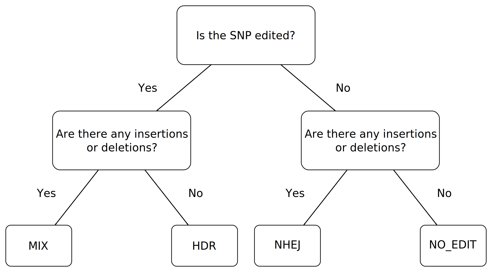

EdiTyper
========

A Python program for aligning CRISPR-edited RNA-seq data. Written by
Alexandre Yahi.

Installation
------------

To install, run the following command

.. code:: bash

    python setup.py install

Please note, to install system-wide, you must have sudo access. If you
are not installing system-wide, please install within your
``$PATH`` and ``$PYTHONPATH``.

Dependencies
------------

EdiTyper is compatible with Python 2.7 and 3.3+; it also depends on the
following Python modules:

-  `Cython <http://cython.org/>`__
-  `NumPy <http://www.numpy.org/>`__
-  `SciPy <https://www.scipy.org/>`__
-  `matplotlib <http://matplotlib.org/>`__
-  `Biopython <http://biopython.org/>`__
-  `regex <https://pypi.python.org/pypi/regex>`__

Each of these modules is available on
`PyPi <https://pypi.python.org/>`__ and installable using
`pip <https://pip.pypa.io/en/stable/>`__

Basic Usage
-----------

To get a basic help message, simply run

.. code:: bash

    EdiTyper

The minimal arguments needed to run are ``-r | --reference-sequence``,
``-t | --template-sequence``, and one of the following:
``-i | --input file``, ``-l | --sample-list``, or
``-d | --fastq-directory``

.. code:: bash

    EdiTyper -r reference.fasta -t template.fasta -i sample.fastq

Classification scheme
---------------------

We classify the unique reads based on their alignment with the
reference. HDR are reads with the right SNP edited to the target SNP as
identified in the template sequence, and no deletion and no insertions
but tolerate mismatches. If there are insertions or deletions then the
read is classified as MIX, which is a HDR with indels. If the SNP of
interest is not edited and there are no indels, then the read is
unchanged (NO\_EDIT). Otherwise, the read is a NHEJ.

|image0|

Arguments
---------

Alignment Arguments
~~~~~~~~~~~~~~~~~~~

+-----------------------------+--------------------------+------------+------------+
| Parameter                   | Definition               | Required?  | Default    |
+=============================+==========================+============+============+
| ``-m | --analysis-mode``    | Set which mismatch       | No         | SNP        |
|                             | between the reference    |            |            |
|                             | and template sequences   |            |            |
|                             | gets analyzed (SNP) and  |            |            |
|                             | which are treated as     |            |            |
|                             | NHEJ (PAM). Specified as |            |            |
|                             | a 'SNP' and a series     |            |            |
|                             | 'PAM's separated by      |            |            |
|                             | '+' characters           |            |            |
|                             | (eg. SNP+PAM, PAM+SNP)   |            |            |
+-----------------------------+--------------------------+------------+------------+
| ``-p | --pvalue-threshold`` | Set the threshold for    | No         | 1 \*10-3   |
|                             | the alignment            |            |            |
+-----------------------------+--------------------------+------------+------------+
| ``-g | --gap-opening``      | Set the gap              | No         | 8          |
|                             | opening penalty          |            |            |
+-----------------------------+--------------------------+------------+------------+
| ``-e | --gap-extension``    | Set the gap              | No         | 1          |
|                             | extension penalty        |            |            |
+-----------------------------+--------------------------+------------+------------+
| ``--parallel``              | Run EdiTyper in          | No         | None       |
|                             | parallel, supports       |            |            |
|                             | optional argumen to      |            |            |
|                             | limit number of cores,   |            |            |
|                             | otherwise uses all       |            |            |
|                             | cores                    |            |            |
+-----------------------------+--------------------------+------------+------------+

Reference Arguments
~~~~~~~~~~~~~~~~~~~

+-------------------------------+----------------------------------+------------+
| Parameter                     | Definition                       | Required?  |
+===============================+==================================+============+
| ``-r | --reference-sequence`` | Reference FASTA for alignment    | **Yes**    |
+-------------------------------+----------------------------------+------------+
| ``-t | --template-sequence``  | Template sequence for editing    | **Yes**    |
+-------------------------------+----------------------------------+------------+
| ``-b | --reference-bed``      | A BED file with the genomic      | No         |
|                               | location of the reference        |            |
|                               | sequence. Used to get the        |            |
|                               | chromosome name and sequence     |            |
|                               | start point. Only the first      |            |
|                               | entry will be read; any line     |            |
|                               | starting with 'browser', 'track' |            |
|                               | or '``#``' will be ignored.      |            |
|                               | Please ensure this is a *zero*-  |            |
|                               | based BED file                   |            |
+-------------------------------+----------------------------------+------------+

Input Arguments
~~~~~~~~~~~~~~~

    **NOTE**: These arguments are mutually exclusive

    **NOTE**: At least one of these arguments is required

+----------------------------+--------------------------------+
| Parameter                  | Definition                     |
+============================+================================+
| ``-i | --input-file``      | Provide a FASTQ file for       |
|                            | aligning, this option can      |
|                            | have multiple FASTQs specified |
+----------------------------+--------------------------------+
| ``-l | --sample-list``     | Provide a list of FASTQ files  |
|                            | for aligning; there should be  |
|                            | one FASTQ per line             |
+----------------------------+--------------------------------+
| ``-d | --fastq-directory`` | Provide a directory where      |
|                            | FASTQ files are located; files |
|                            | must end in .fastq or .fq      |
|                            | (.gz is allowed afterwards)    |
+----------------------------+--------------------------------+

Output Arguments
~~~~~~~~~~~~~~~~

    **NOTE**: All of these arguments are optional

+-----------------------------+--------------------------------------------------------------+------------+
| Parameter                   | Definition                                                   | Default    |
+=============================+==============================================================+============+
| ``-d | --output-directory`` | Choose where to put all output files                         | 'output'   |
+-----------------------------+--------------------------------------------------------------+------------+
| ``-j | --project``          | Give this project a name, will be used as the basename for   | 'edityper' |
|                             | batch output files (summary, quality plot, etc)              |            |
+-----------------------------+--------------------------------------------------------------+------------+
| ``--bam``                   | Convert SAM files to BAM files, optionally use CSI indices   | None       |
|                             | instead of BAI indices with ``--bam csi``; requires          |            |
|                             | `SAMtools <https://github.com/samtools/samtools>`__          |            |
+-----------------------------+--------------------------------------------------------------+------------+

Read Group Arguments
~~~~~~~~~~~~~~~~~~~~

    **NOTE**: Information provided will be applied to *all* read groups
    in *all* FASTQ files

    **NOTE**: All of these arguments are optional and will only be used
    if SAM/BAM output is *not* suppressed

+-----------------------------+---------------------------------+-----------+
| Parameter                   | Definition                      | Default   |
+=============================+=================================+===========+
| ``-rc | --read-center``     | Name of the sequencing center   | None      |
+-----------------------------+---------------------------------+-----------+
| ``-rl | --read-library``    | Sequencing library              | None      |
+-----------------------------+---------------------------------+-----------+
| ``-rp | --read-platform``   | Platform used for sequencing    | None      |
+-----------------------------+---------------------------------+-----------+
| ``-rs | --read-sample``     | Sample being sequenced          | None      |
+-----------------------------+---------------------------------+-----------+

Suppression Arguments
~~~~~~~~~~~~~~~~~~~~~

    **NOTE**: Once *cannot* suppress all output

+---------------------------------+------------------------------------------------+
| Parameter                       | Definition                                     |
+=================================+================================================+
| ``--suppress-sam``              | Suppress SAM output                            |
+---------------------------------+------------------------------------------------+
| ``--suppress-events``           | Suppress events table output                   |
+---------------------------------+------------------------------------------------+
| ``--suppress-classification``   | Suppress read classification output            |
+---------------------------------+------------------------------------------------+
| ``--suppress-tables``           | Suppress both events and read classification   |
+---------------------------------+------------------------------------------------+
| ``--suppress-plots``            | Suppress locus and quality plots               |
+---------------------------------+------------------------------------------------+

Output Files
------------

For each output table, all lines starting with ``#`` are header lines.
All lines starting with ``##`` are extra information. See details below
for specifics about each output.

+--------------------------------------------------------+---------------------------+
| Output file                                            | Extension                 |
+========================================================+===========================+
| Alignments in SAM/BAM format                           | ``.sam | .bam``           |
+--------------------------------------------------------+---------------------------+
| Table of events by base                                | ``.events.txt``           |
+--------------------------------------------------------+---------------------------+
| Classification of reads in tabular format              | ``.classification.txt``   |
+--------------------------------------------------------+---------------------------+
| Locus and alignment quality plots                      | ``.pdf``                  |
+--------------------------------------------------------+---------------------------+
| Summary of read classifications per input FASTQ file   | ``.summary.txt``          |
+--------------------------------------------------------+---------------------------+
| Read assignments table                                 | ``.assignments.txt``      |
+--------------------------------------------------------+---------------------------+

SAM/BAM Output
~~~~~~~~~~~~~~

SAM alignments are standard SAM files. They have been presorted in
coordinate order with read groups attached. If BAM output, BAM indices
will also be output in either BAI or CSI format. For more details, see
SAM/BAM format specification from `HTSlib <http://www.htslib.org/>`__.

Events Table
~~~~~~~~~~~~

The ``.events.txt`` table shows a locus-by-locus overview of indels and
mismatches in each FASTQ file. One table is generated per FASTQ file.

+---------------+----------------------------------------------------------+
| Column        | Meaning                                                  |
+===============+==========================================================+
| ``POS``       | Position in reference sequence                           |
+---------------+----------------------------------------------------------+
| ``REF``       | Nucleotide in reference sequence at this position        |
+---------------+----------------------------------------------------------+
| ``COV``       | Coverage in FASTQ at position                            |
+---------------+----------------------------------------------------------+
| ``DEL``       | Number of deletions starting at this position            |
+---------------+----------------------------------------------------------+
| ``AVG_DEL``   | Average length of deletions starting at this position    |
+---------------+----------------------------------------------------------+
| ``DCOUNT``    | Number of times this position is deleted                 |
+---------------+----------------------------------------------------------+
| ``INS``       | Number of insertions starting at this position           |
+---------------+----------------------------------------------------------+
| ``AVG_INS``   | Average length of insertions starting at this position   |
+---------------+----------------------------------------------------------+
| ``A``         | Count of mismatched A's at this position                 |
+---------------+----------------------------------------------------------+
| ``T``         | Count of mismatched T's at this position                 |
+---------------+----------------------------------------------------------+
| ``C``         | Count of mismatched C's at this position                 |
+---------------+----------------------------------------------------------+
| ``G``         | Count of mismatched G's at this position                 |
+---------------+----------------------------------------------------------+

Read Classifications
~~~~~~~~~~~~~~~~~~~~

The ``.classifications.txt`` table shows a breakdown of indels and
mismatches per read category. One table is generated per FASTQ file. The
read categories are HDR, MIX, NHEJ, NO\_EDIT, and DISCARD.

+---------------------+---------------------------------------+
| Column              | Meaning                               |
+=====================+=======================================+
| ``TAG``             | Which classification category; one of |
|                     | HDR, MIX, NHEJ, NO\_EDIT, or DISCARD  |
+---------------------+---------------------------------------+
| ``COUNT``           | How many  reads fall in this          |
|                     | classification category?              |
+---------------------+---------------------------------------+
| ``PERC_COUNT``      | What percentage of reads fall in this |
|                     | classification category; excludes     |
|                     | discarded reads from calculation      |
+---------------------+---------------------------------------+
| ``INS_EVENTS``      | Total number of insertion events;     |
|                     | reported for HDR, MIX, and NHEJ only  |
+---------------------+---------------------------------------+
| ``AVG_INS``         | Average number of insertion events    |
|                     | per read; reported for HDR, MIX, and  |
|                     | NHEJ only                             |
+---------------------+---------------------------------------+
| ``STD_DEV_INS``     | Standard deviation of the             |
|                     | distribution of insertions; reported  |
|                     | for HDR, MIX, and NHEJ only           |
+---------------------+---------------------------------------+
| ``DEL_EVENTS``      | Total number of deletion events;      |
|                     | reported for HDR, MIX, and NHEJ only  |
+---------------------+---------------------------------------+
| ``AVG_DEL``         | Average number of deletion events per |
|                     | read; reported for HDR, MIX,          |
|                     | NHEJ only                             |
+---------------------+---------------------------------------+
| ``STD_DEV_DEL``     | Standard deviation of the             |
|                     | distribution of deletions; reported   |
|                     | for HDR, MIX, and NHEJ only           |
+---------------------+---------------------------------------+
| ``MISMATCH_EVENTS`` | Total number of mismatch events;      |
|                     | reported for HDR, MIX, and NHEJ only  |
+---------------------+---------------------------------------+
| ``AVG_MIS``         | Average number of mismatch events per |
|                     | read; reported for HDR, MIX, and      |
|                     | NHEJ only                             |
+---------------------+---------------------------------------+
| ``STD_DEV_MIS``     | Standard deviation of the             |
|                     | distribution of mismatches; reported  |
|                     | for HDR, MIX, and NHEJ only           |
+---------------------+---------------------------------------+
| ``NO_INDELS``       | Number of reads with no indels;       |
|                     | reported for HDR and MIX only         |
+---------------------+---------------------------------------+
| ``PERC_NO_INDELS``  | Percentage of reads with no indels;   |
|                     | reported for HDR and MIX only         |
+---------------------+---------------------------------------+
| ``INS_ONLY``        | Number of reads with with only        |
|                     | insertions; reported for HDR and      |
|                     | MIX only                              |
+---------------------+---------------------------------------+
| ``PERC_INS_ONLY``   | Percentage of reads with only         |
|                     | insertions; reported for HDR and      |
|                     | MIX only                              |
+---------------------+---------------------------------------+
| ``DEL_ONLY``        | Number of reads with only deletions;  |
+---------------------+---------------------------------------+
| ``PERC_DEL_ONLY``   | Percentage of reads with only         |
|                     | deletions; reported for HDR and       |
|                     | MIX only                              |
+---------------------+---------------------------------------+
| ``INDELS``          | Number of reads with both insertions  |
|                     | and deletions; reported for HDR and   |
|                     | MIX only                              |
+---------------------+---------------------------------------+
| ``PERC_INDELS``     | Percentage of reads with both         |
|                     | insertions and deletions; reported    |
|                     | for HDR and MIX only                  |
+---------------------+---------------------------------------+

Summary Table
~~~~~~~~~~~~~

The ``.summary.txt`` table shows total reads, unique reads, discarded
reads, SNP information, no editing, HDR, NHEJ, and mismatch percentages
by base. One table is generated for *all* FASTQ files.

+--------------------+--------------------------------+
| Column             | Meaning                        |
+====================+================================+
| ``FASTQ``          | Name of FASTQ file             |
+--------------------+--------------------------------+
| ``TOTAL_READS``    | Total number of reads          |
|                    | in this FASTQ file             |
+--------------------+--------------------------------+
| ``TOTAL_NON_DISC`` | Total number of reads          |
|                    | in this FASTQ file,            |
|                    | excluding discarded            |
|                    | reads                          |
+--------------------+--------------------------------+
| ``UNIQ_READS``     | Total number of unique,        |
|                    | non-discarded reads            |
+--------------------+--------------------------------+
| ``DISCARDED``      | Number of discarded reads      |
+--------------------+--------------------------------+
| ``SNP_POS``        | SNP position                   |
+--------------------+--------------------------------+
| ``REF_STATE``      | Reference state                |
+--------------------+--------------------------------+
| ``TEMP_SNP``       | Alternate state                |
+--------------------+--------------------------------+
| ``NO_EDIT``        | Number of non-edited reads     |
+--------------------+--------------------------------+
| ``PERC_NO_EDIT``   | Percentage of reads classified |
|                    | as not edited, excluding       |
|                    | discarded reads                |
+--------------------+--------------------------------+
| ``HDR``            | Number of clean HDR reads      |
+--------------------+--------------------------------+
| ``PERC_HDR``       | Percentage of reads classified |
|                    | as HDR, excluding discarded    |
|                    | reads                          |
+--------------------+--------------------------------+
| ``MIX``            | Number of MIX reads            |
+--------------------+--------------------------------+
| ``PERC_MIX``       | Percentage of reads classified |
|                    | as MIX, excluding discarded    |
|                    | reads                          |
+--------------------+--------------------------------+
| ``NHEJ``           | Number of NHEJ reads           |
+--------------------+--------------------------------+
| ``PERC_NHEJ``      | Percentage of reads classified |
|                    | as NHEJ, excluding discarded   |
|                    | reads                          |
+--------------------+--------------------------------+
| ``PERC_MIS_A``     | Percentage of mismatches with  |
|                    | an A compared to total number  |
|                    | of mismatches                  |
+--------------------+--------------------------------+
| ``PERC_MIS_T``     | Percentage of mismatches with  |
|                    | an T compared to total number  |
|                    | of mismatches                  |
+--------------------+--------------------------------+
| ``PERC_MIS_C``     | Percentage of mismatches with  |
|                    | an C compared to total number  |
|                    | of mismatches                  |
+--------------------+--------------------------------+
| ``PERC_MIS_G``     | Percentage of mismatches with  |
|                    | an G compared to total number  |
|                    | of mismatches                  |
+--------------------+--------------------------------+

Locus and Quality Plots
~~~~~~~~~~~~~~~~~~~~~~~

The locus plot shows events at each base along the reference and the
number of supporting reads for each event. One PDF is generated per
FASTQ file. The first page is scaled to total number of reads in the
FASTQ file, the second is scaled to maximum number of supporting reads
accross all events. Coverage at each base is also shown.

The quality plot shows the distribution of alignment quality scores. One
PDF is generated for *all* FASTQ files. The quality-score threshold for
discarding reads is shown as a black bar.

Assignments Table
~~~~~~~~~~~~~~~~~

The ``.assignments.txt`` table shows how each read was classified as
well as the number of insertions, deletions, and mismatches for each
read. One table is generated per FASTQ. This table is *only* generated
when verbosity is set to 'debug' (``-v debug | --verbosty debug``) and
``--suppress-tables`` is **not** passed.

+--------------+----------------------------------------+
| Column       | Meaning                                |
+==============+========================================+
| ``ReadID``   | Read ID from the FASTQ file            |
+--------------+----------------------------------------+
| ``Label``    | Classification assigned to this read   |
+--------------+----------------------------------------+
| ``NumDel``   | Number of deletions in this read       |
+--------------+----------------------------------------+
| ``NumIns``   | Number of insertions in this read      |
+--------------+----------------------------------------+
| ``NumMis``   | Number of mismatches in this read      |
+--------------+----------------------------------------+

