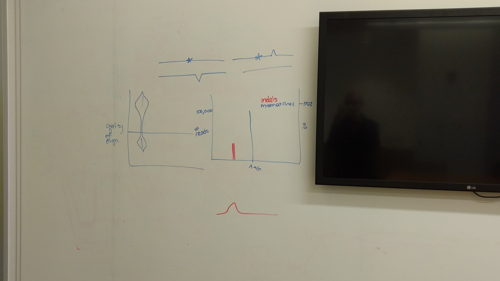

# Notes for CRISPR pipeline from Margot Brandt

## TODO
 - Output: split and named by FASTQ files
 - Locus-plot y axes: percentage/num reads
 - Scores plot: more logical rationale for 'off target'
 - 
 - `general.txt`
   - %HDR and %NHEJ include discarded reads &larr; change
   - ~~Table format~~ DONE!
   - See `batch_summary.txt` for example
   - Keep `batch_summary.txt` with better name
 - Phasing information
